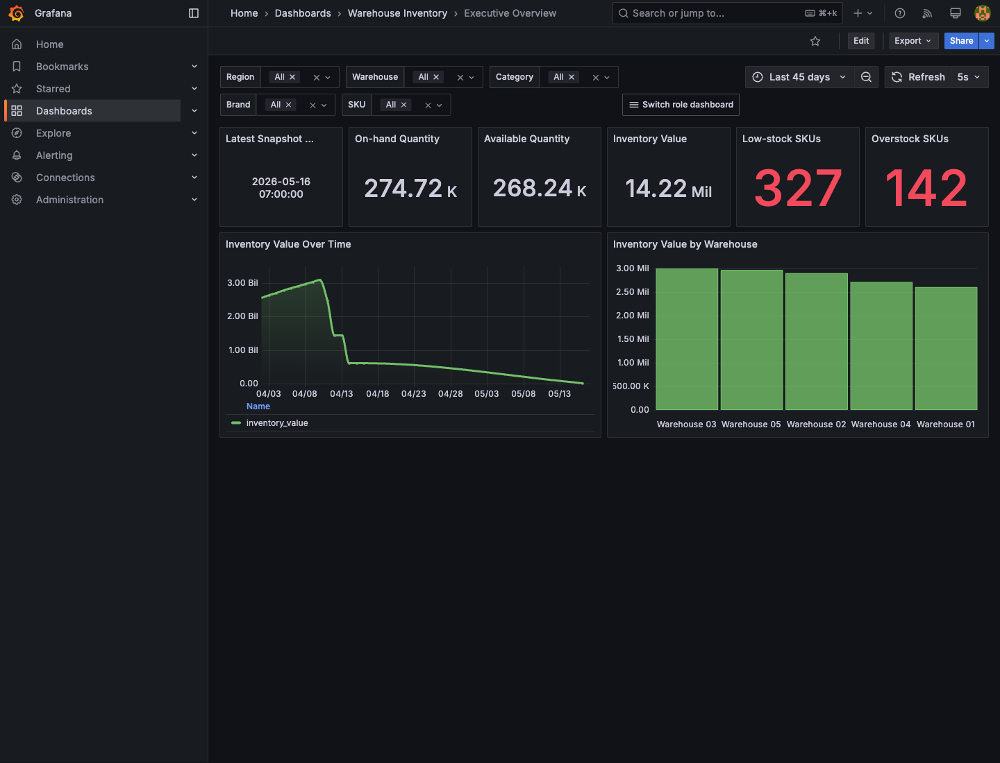
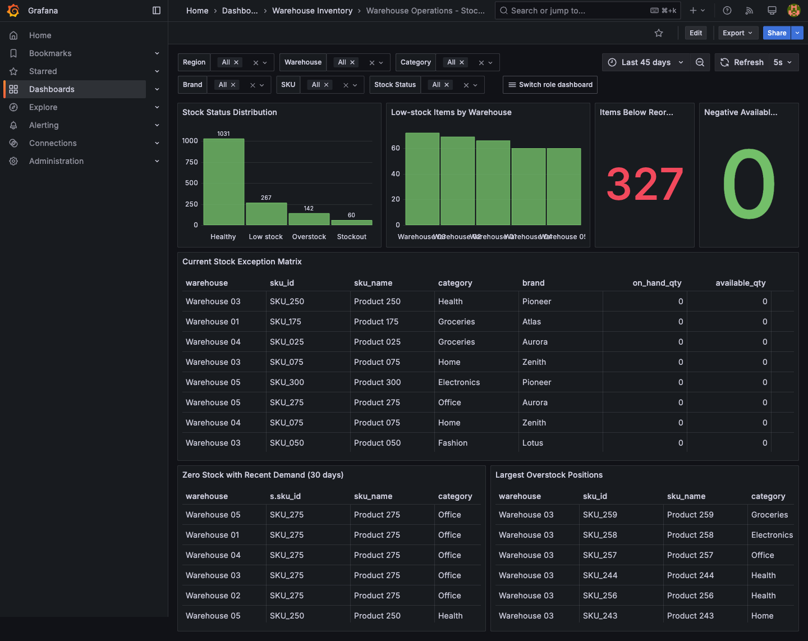
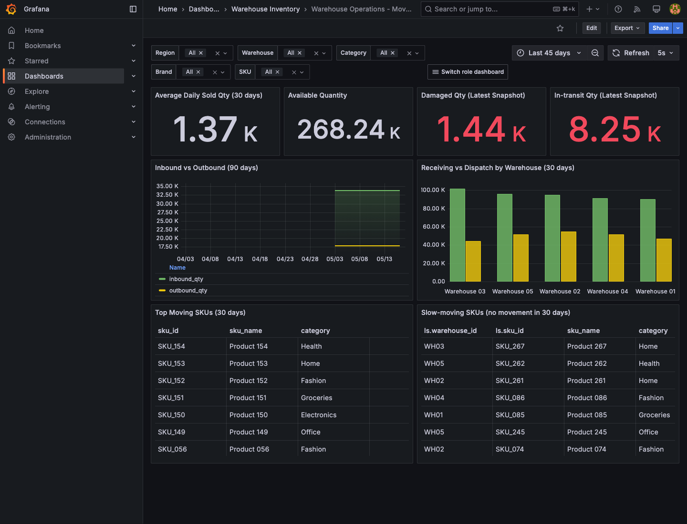
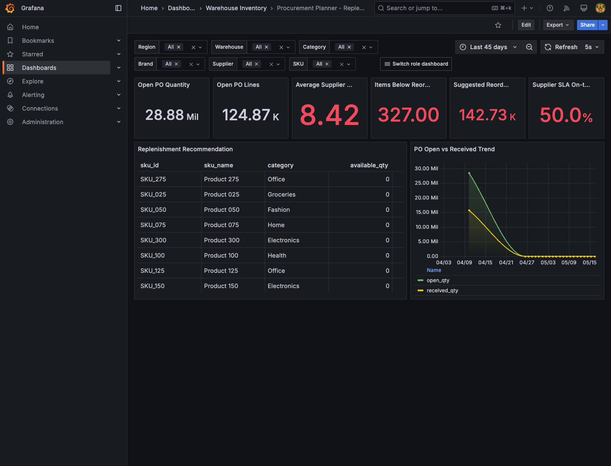
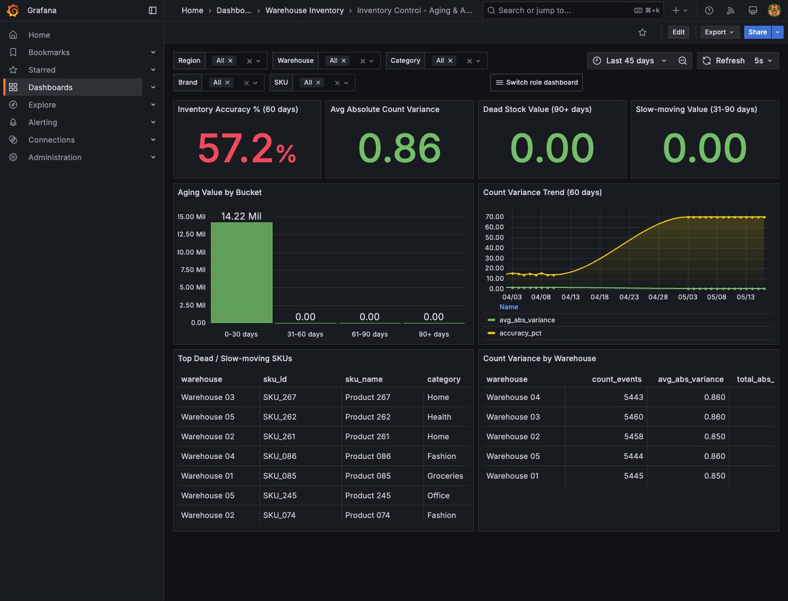
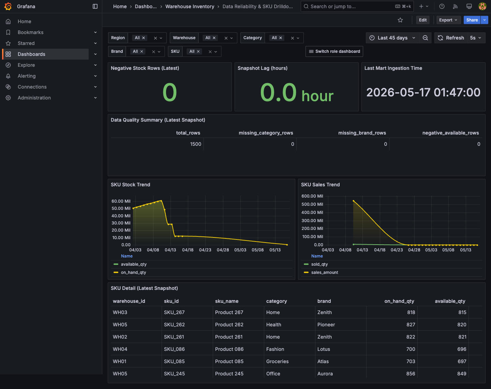

# Grafana Role Dashboard Report Pack

Captured: 2026-05-17 01:49:25 +07  
Grafana: http://localhost:3002  
Datasource: ClickHouse `inventory_mart`  
Refresh cadence: 5 seconds  
Latest demo business date: 2026-05-16

This report pack documents the role-based Grafana dashboard split for the inventory source-ingestion demo. The previous overloaded dashboard view has been separated into focused dashboards by business role and operational workflow.

Before capture, recent demo rows were initialized for date-sensitive dashboard windows such as last-30-day sales, last-30-day purchase orders, last-60-day stock counts, current movement flow, and latest inventory snapshot. Playwright capture validation found `No data` count = 0 and no panel error indicators across all six dashboards.

## Dashboard Map

| Screenshot | Dashboard | Primary role | Feature focus | Report angle |
|---|---|---|---|---|
| `01-executive-overview.png` | Executive Overview | Leadership / reviewer | Inventory value, stock health, latest snapshot, warehouse value distribution | High-level business health and decision summary |
| `02-stock-exceptions.png` | Warehouse Operations - Stock Exceptions | Warehouse operator | Stockout, low stock, overstock, exception list | Day-to-day action queue for warehouse staff |
| `03-movement-flow.png` | Warehouse Operations - Movement Flow | Operations lead | Inbound/outbound movement trend, movement mix, active SKU flow | Operational throughput and inventory movement behavior |
| `04-procurement-replenishment.png` | Procurement Planner - Replenishment | Buyer / planner | Reorder needs, open purchase quantity, supplier performance, replenishment table | Purchase planning and replenishment prioritization |
| `05-aging-accuracy.png` | Inventory Control - Aging & Accuracy | Inventory controller | Aging buckets, slow/dead stock, stock-count accuracy, variance by warehouse | Control, audit, and accuracy monitoring |
| `06-data-reliability-sku-drilldown.png` | Data Reliability & SKU Drilldown | Data owner / analyst | Mart freshness, ingestion lag, data quality checks, SKU trend drilldown | Data trust and source-ingestion reliability |

## Feature Summary

### Executive Overview

The executive dashboard is designed for a quick health check. It keeps the reviewer focused on inventory scale, total value, current exception volume, latest snapshot date, and warehouse-level value concentration.

Use this screen to explain why the dashboard split improves readability: a non-technical reviewer can understand the overall state without seeing detailed operational tables.

### Warehouse Operations - Stock Exceptions

This dashboard turns stock health into an action queue. It separates healthy stock from stockout, low-stock, and overstock cases, then lists the SKUs that need intervention.

Use this screen to discuss daily warehouse operations: operators can find exception SKUs directly instead of scanning every inventory metric.

### Warehouse Operations - Movement Flow

This dashboard focuses on how stock moves through the warehouse. It highlights inbound and outbound quantity, movement type mix, active SKUs, and movement trends.

Use this screen to explain near-real-time source ingestion: movement data is suitable for operational monitoring because the demo now refreshes at a 5-second cadence.

### Procurement Planner - Replenishment

This dashboard is scoped to buying and replenishment decisions. It combines current stock, recent demand, open purchase quantities, supplier signals, and recommended reorder quantities.

Use this screen to show how the same ingestion pipeline supports planning workflows, not only warehouse monitoring.

### Inventory Control - Aging & Accuracy

This dashboard supports control and audit workflows. It separates stock aging, slow-moving value, stock-count accuracy, and warehouse variance into a focused control view.

Use this screen to discuss inventory governance: controllers can identify accuracy problems and aging risk without being distracted by procurement or executive panels.

### Data Reliability & SKU Drilldown

This dashboard explains whether the reporting layer can be trusted. It shows ingestion freshness, mart lag, data-quality checks, and a SKU-level drilldown for snapshot and sales movement.

Use this screen to connect dashboard quality back to source ingestion: reviewers can see both business metrics and the reliability signals behind them.

## Report Notes

- Dashboards are provisioned from `grafana/dashboards`.
- All six dashboards use the `inventory-role` tag and include a `Switch role dashboard` link.
- Each dashboard refreshes every 5 seconds for the near-real-time demo.
- Logstash source polling and table-level interval mapping are summarized in `../logstash_ingestion_intervals.md`.
- The report narrative should emphasize role separation, reduced visual clutter, and clearer reviewer workflow.
- The screenshots were captured with Playwright after confirming all visible dashboard pages had data.
